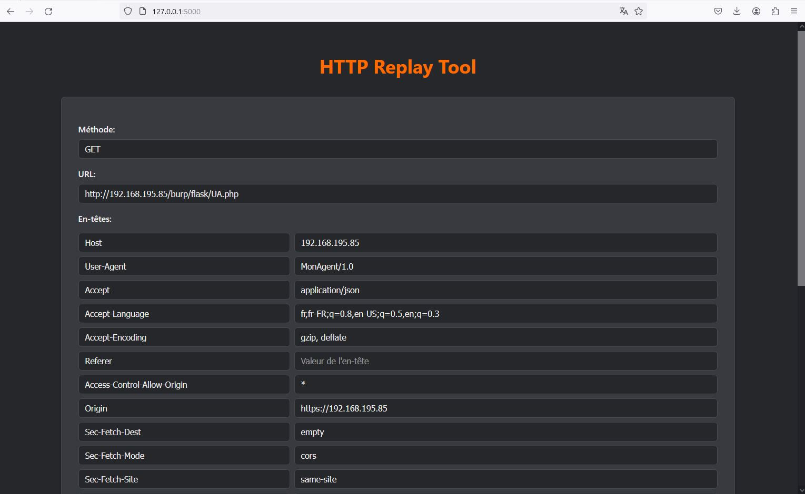
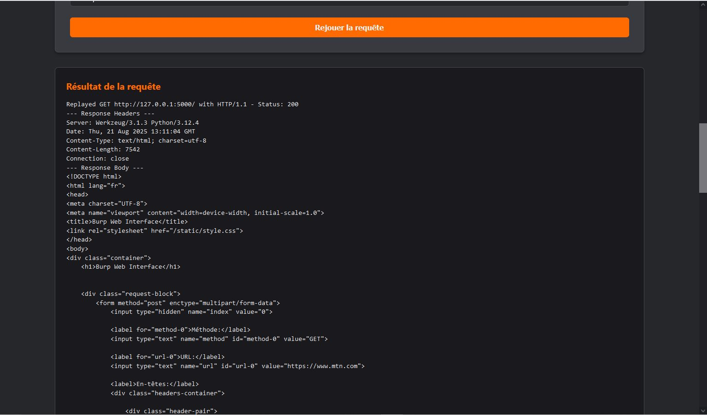
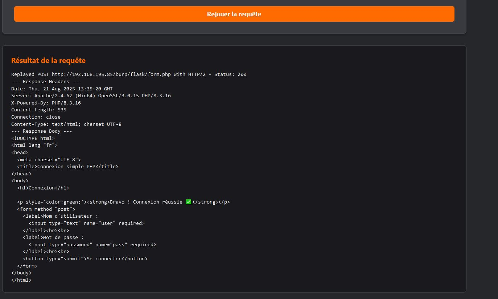

# HTTP Replay Tool

**HTTP Replay Tool** est une interface web légère, construite avec **Flask** et **Python**, conçue pour simplifier le débogage et le test des requêtes HTTP. Il permet de rejouer des requêtes enregistrées (importées depuis un fichier JSON) en modifiant facilement les méthodes, les URL, les en-têtes et le corps de la requête, y compris les fichiers.

### Fonctionnalités clés

* **Rejeu de requêtes :** Exécutez des requêtes HTTP `GET` et `POST` avec des options personnalisables.
* **Support des en-têtes et du corps :** Modifiez dynamiquement les en-têtes et les données de la requête.
* **Téléversement de fichiers :** Gère le rejeu des requêtes `multipart/form-data`, y compris la manipulation des fichiers.
* **Interface intuitive :** Un design simple inspiré de l'outil **Burp Suite Repeater**, facile à prendre en main pour les développeurs et les testeurs.
* **Flexibilité du protocole :** Prend en charge les protocoles **HTTP/1.1** et **HTTP/2**.

---

### Aperçu de l'interface

Voici un aperçu de l'outil en action.

<div align="center">
  
  
  
</div>

> 
---


---

### Comment utiliser

1.  **Clonez le dépôt :**
    ```sh
    git clone https://github.com/dream434/HTTP-Replay-Tool.git
    cd HTTP-Replay-Tool.git
    ```
2.  **Installez les dépendances :**
    ```sh
    pip install -r requirements.txt
    ```
    (Nécessite `Flask` et `requests`).
3.  **Lancez l'application :**
    ```sh
    python app.py
    ```
4.  **Ouvrez dans votre navigateur :**
    Accédez à `http://127.0.0.1:5000` et commencez à rejouer vos requêtes.


### Avis de non-responsabilité

Cet outil a été conçu à des fins éducatives et de test uniquement. L'utilisation de cet outil pour des activités illégales ou malveillantes est strictement interdite. L'utilisateur est seul responsable de ses actions et doit s'assurer qu'il a l'autorisation nécessaire pour tester les systèmes cibles.
